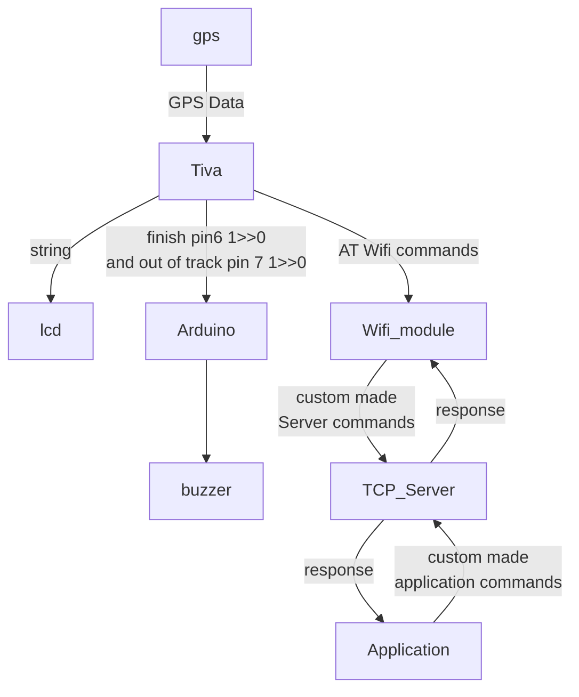

# GPS Tracker using Tiva tm4c123gxl

This embedded module tracks your location using the gps module and parses all information it can from the NMEA Message, like time, date and location. Sends the information to a JAVA server and the server then sends it to an application which show the position of the TIVA

> All drivers are written with code reusability in mind.
## Extra features 
* LCD >>displays the time ,speed and location 
* java server 
* wifi module >> makes connection wireless with pc
* Application >>diplays same LCD info on pc 

* arduino mega + speaker >> treats pin 6 and 7 as the leds of TIVA so the speaker produces different songs in different situations

* 
|case         | pin 6    |pin 7  | song number |
| --- | --- | --- | --- |
|normal       |  1       |  1    |[ song 1  ](https://github.com/abdlrhman08/GPS-Tracker-Tiva/assets/131257593/dc533af5-15f0-44e5-ad75-5462614586d0)    |
|out of track |  1       |  0    | song 2      |
|finish       |  0       |  1    | song 3      |
|impossible   |  0       |  0    | song 4      |
## Contributors

|Name        | code    |Department  | 
| :--- | :---: | :---: |
|Nassar khaled mesoud | 2001464 | CSE|
|abdelrahman atef saad hamada |2101645| CSE|
|abdelrahman zain mohmed |2101645| CSE|
|mahmoud osama mohmed abdelaal| 2101713| ECE|
|shawky ahmed shawky |2002020 |CSE|
|ahmed adel ali mashal| 2002296 |ECE |
### Data flow

[Server repo](https://github.com/abdlrhman08/GPS-Tracker-Server)

|Command      | Description  | 
| :--- | :--- |

