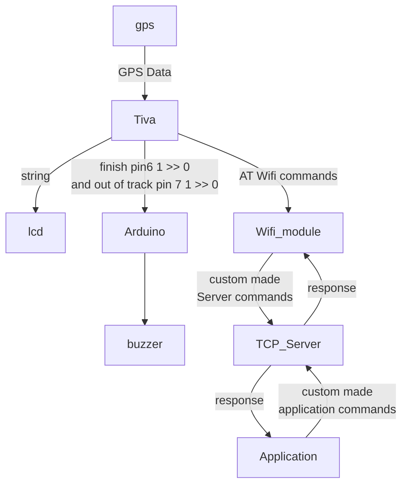

# GPS Tracker Tiva TM4c123 GXL(accumulative work of 500 hours)

This embedded module tracks your location using the gps module and parses all information it can from the NMEA Message, like time, date and location. Sends the information to a JAVA server and the server then sends it to an application which show the position of the TIVA,

> All drivers are written with code reusability in mind.
# Extra features 
* ## LCD :arrow_right: displays the time ,speed and location 
* ## Java Server 
* ## Wifi module :arrow_right: makes connection wireless with pc
* ## Application :arrow_right: diplays same LCD info on pc 

* ### arduino mega + speaker >> treats pin 6 and 7 as the leds of TIVA so the speaker produces different songs in different situations

## Contributors

|Name        | code    |Department  | 
| :--- | :---: | :---: |
|Nassar khaled mesoud | 2001464 | CSE|
|abdelrahman atef saad hamada |2101645| CSE|
|abdelrahman zain mohmed |2101646| CSE|
|mahmoud osama mohmed abdelaal| 2101713| ECE|
|shawky ahmed shawky |2002020 |CSE|
|ahmed adel ali mashal| 2002296 |ECE |
### Data flow

[Server repo](https://github.com/abdlrhman08/GPS-Tracker-Server)

## 1-Tiva
---

|Name      | Description  | 
| :--- | :--- |
|UART | the brain of the project ,its drivers where a big problem to handle ,We didnt write a usual one , especially our uart driver in which we avoided the reduduncy and made one function |

## 2-GPS module
---
#we forced the GPS to send data in RMS form and extracted the speed and time from it to be displayed on 

## 3-Wifi module
---
### the linking point between Tiva and Server

|Command      | Description  | 
| :--- | :--- |

## 4-LCD
---

## 5-TCP Server
---
When the client is first connected to the server, the server waits for.a 4 byte message to identify themself|

|Command      | Description  | 
| :--- | :--- |
|tiva| This message is sent by the Wi-Fi module of the Tiva, so the server understands that it will later send the destination point to it|
|appl| This message is sent by the application, the server will know that it will be the one who assigns the destination point After the server receives the identification message it will assign a thread to the client and start the lifecycle loop and wait for commands|
|dest |This commands the server first checks if it is sent by the app or the tiva, if it is the send by the app it sends a one byte message '1'.   This message tells the client that it is waiting for a response. Here the application should send to the application the destination point where you want the Tiva to go. If the command was send by Tiva it will respond with the same one byte message and it will wait for the Tiva to respond with its starting point.   After that, the Server will reply to the tiva with the destination point which the app sent first|

## 6-.net Application
---

## 7-Arduino with Speaker
---

|case         | pin 6    |pin 7  | song number |                       |
| --- | --- | --- | --- | --- |
|normal       |  1       |  1    |[ song 1  ](https://github.com/abdlrhman08/GPS-Tracker-Tiva/assets/89034348/8d0e7e9b-3f33-4e29-b987-f7ab8c413f91)    ||
|out of track |  1       |  0    | [song 2](https://github.com/abdlrhman08/GPS-Tracker-Tiva/assets/89034348/8d0e7e9b-3f33-4e29-b987-f7ab8c413f91)     |&nbsp;|
|finish       |  0       |  1    | [song 3](https://github.com/abdlrhman08/GPS-Tracker-Tiva/assets/89034348/43420f24-f454-4257-99c2-2e1e415663c0)      ||
|impossible   |  0       |  0    | Off     |

## 8-power circuit and power bank  to feed all the devices
---
### switches and regulator to feed the wifi module with 3.3v and lcd with 5 v otherwise it will cause flames
---
!

## 9-Beautiful packaging
---

## end
### we brain stormed many ideas learnt about many things ,struggled ,we proved to our selves that we could push our limits ,believe in each other . 

